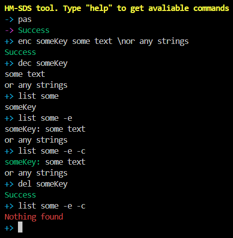
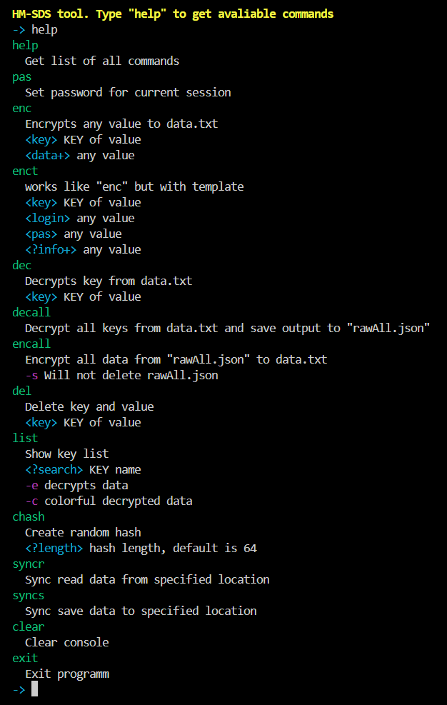

# HM-SDS

Simple Node.JS CLI for locally storing any string data, such as passwords.

The data is stored in `./data.txt` as a string, which is actually a simple json, and is encrypted with a password using `aes-256-cbc`.

Supports automatic sync via other sync software like iCloud, just enable it in the configuration.

> No dependencies, one js file, completely local.

## example

## help

